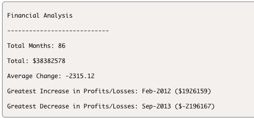

# Console-Finances

<b> This is a JavaScript file that contains code to analyse financial data </b>

# Analysis of Financial Data

This is a JavaScript library which contains code that analysis array of financial data showing profit/losses of each month over a set period of time. 

## Description

The code will show the below list of information in the console when you inspect using Chrome Dev Tool. 

- Total number of months included in the dataset
- Net total amount of Profit/Losses over the entire period
- Average of the Changes in Profit/Losses (tracks the total change in Profit/Losses from month to month)
- Greatest Increase in Profit/Losses (displaying date and amount) over the entire period
- Greatest Decrease in Profit/Losses (displaying date and amount) voer the entire period

console.log has been added throughout the script to ensure that there are no errors within the code. 
[This can be removed if necessary]

## Usage
Code is written so the above analysis will be completed. 

Different set of data can be replaced and the code can be reused if the data is input in the form of an array within an array. 

Example: 

var Array = [

  ["month - year" , number],
  
  ....

]

## Contributing

Pull requests are welcome. For major changes, please open an issue first
to discuss what you would like to change.

Please make sure to update tests as appropriate.

## License

[MIT](https://choosealicense.com/licenses/mit/)

## The final deployed application should look like this

<b> URL to the deployed website </b>
https://chae-lee.github.io/console-finances/

<b> Screenshot of console </b>

